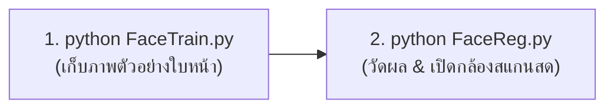

# 👤 Real-Time Face Recognition System (KNN from Scratch)

ระบบรู้จำและตรวจจับใบหน้าแบบเรียลไทม์ (Real-time Face Recognition) พัฒนาด้วยภาษา Python โดยใช้หลักการ **K-Nearest Neighbors (KNN)** แบบเขียนขึ้นเองจากพื้นฐาน (From Scratch) โครงสร้างโค้ดกระชับ คลีน เข้าใจง่าย ทำงานผ่าน 2 ไฟล์หลัก พร้อมระบบตัดภาพ Region of Interest (ROI) อัตโนมัติ, การวัดผลประเมินโมเดล (Train/Test Split & Accuracy 95.2%) และการแสดงผล 2 หน้าต่างผ่าน OpenCV

---

## 🏗️ โครงสร้างโปรเจกต์ (Project Structure)

```
face_recognition_project/
├── FaceTrain.py              # [1] ระบบเปิดกล้องถ่ายภาพตัวอย่างใบหน้า & ลงทะเบียนสมาชิก
├── FaceReg.py                # [2] สมองกล KNN โหลดข้อมูล วัด Accuracy และเปิดกล้องสแกนหน้าสด
├── requirements.txt          # รายการ Library (numpy, opencv-python)
├── README.md                 # คู่มือและคำอธิบายระบบฉบับสมบูรณ์
├── .gitignore                # ละเว้นไฟล์ที่ไม่เกี่ยวข้อง
└── data/
    └── faces/                # โฟลเดอร์เก็บภาพใบหน้าแยกรายคน ({รหัส}_{ชื่ออังกฤษ}_{ชื่อไทย}/)
        ├── 6752300194_Teerapat Thongtumlueng_ธีรภัทร ทองตำลึง/
        ├── 6752301255_Phongdanai Somphan_พงษ์ดนัย สมภาร/
        └── 6752301271_Tawaikiar Phoowang_ถวายเกียรติ ปู่วัง/
```

---

## ⚙️ การติดตั้งและเตรียมใช้งาน (Installation)

```bash
# 1. เข้าสู่โฟลเดอร์โปรเจกต์
cd face_recognition_project

# 2. เปิดใช้งาน Conda Environment (หรือ Virtual Environment)
conda activate knn

# 3. ติดตั้ง Library ที่จำเป็น
pip install -r requirements.txt
```

---

## 🚀 ขั้นตอนการใช้งาน (2-Step Workflow)



### 📸 ขั้นตอนที่ 1: ถ่ายรูปและลงทะเบียนสมาชิก (`FaceTrain.py`)
```bash
python FaceTrain.py
```
1. ระบบจะเปิดกล้องขึ้นมา 2 หน้าต่าง:
   * **`Camera`** : ภาพวิดีโอสดเต็มจอ พร้อมกรอบสี่เหลี่ยมสีส้มและป้ายบอกจำนวนรูปที่บันทึกได้
   * **`ROI`** : ภาพใบหน้าขาวดำที่ถูกตัดและย่อเป็น $64 \times 64$ พิกเซล (ขยายพรีวิวเป็น $200 \times 200$)
2. **การควบคุม:**
   * กดปุ่ม **`S`** : บันทึกภาพใบหน้าทีละรูป (แนะนำให้ถ่ายหลากหลายมุม/ระยะ ประมาณ 100–300 รูป)
   * กดปุ่ม **`Q`** หรือ **`ESC`** : จบการถ่ายภาพ
3. เมื่อปิดกล้อง ให้พิมพ์ข้อมูลสมาชิก 3 ช่องใน Terminal:
   * **รหัสนักศึกษา** (เช่น `6752301255`)
   * **ชื่อ (อังกฤษ)** (เช่น `Phongdanai Somphan`)
   * **ชื่อ (ไทย)** (เช่น `พงษ์ดนัย สมภาร`)
4. ระบบจะสร้างโฟลเดอร์และบันทึกไฟล์ภาพเป็น `img_001.jpg`, `img_002.jpg` ... ให้โดยอัตโนมัติ

---

### 🎥 ขั้นตอนที่ 2: วัดผล Accuracy และสแกนหน้าแบบ Real-Time (`FaceReg.py`)
```bash
python FaceReg.py
```
1. **เมื่อเริ่มรัน:** ระบบจะโหลดภาพทั้งหมดใน `data/faces/` มาสุ่มแบ่งข้อมูล $80/20$ (Train/Test Split) เพื่อทดสอบวัดผลความแม่นยำ และพิมพ์ผลลัพธ์ออกมา เช่น:
   ```text
   โหลด 1049 รูป 3 คน | Accuracy: 95.2% (ทดสอบ 209 รูป)
   ```
2. **เปิดกล้องสแกนสด:**
   * ระบบจะนำใบหน้าในกรอบสี่เหลี่ยมมาคำนวณระยะห่าง **Euclidean Distance** เทียบกับรูปในระบบทั้งหมด
   * ค้นหา $K=3$ รูปที่ใกล้เคียงที่สุด และนับคะแนนโหวตเสียงข้างมาก
   * **เกณฑ์การตัดสินใจ 2 ชั้น (Double Check):**
     $$\text{Matched} \iff (\text{Confidence} \ge 0.60) \land (\text{Distance} \le 12.0)$$
     * **ผ่านเกณฑ์:** ขึ้น **กรอบสีเขียว** พร้อมแสดงรหัส+ชื่อภาษาอังกฤษบนหน้าจอ และพิมพ์ภาษาไทยลง Terminal
     * **ไม่ผ่านเกณฑ์:** ขึ้น **กรอบสีแดง** พร้อมข้อความ `Unknown`
3. กดปุ่ม **`Q`** หรือ **`ESC`** เพื่อปิดโปรแกรม

---

## 🧠 คำอธิบายโค้ดและหลักการทำงาน (Code Mechanics)

### 1. `FaceTrain.py` (ระบบประมวลผลภาพ & จัดการไฟล์)
* **`get_face(frame)` :**
  * คำนวณขนาดกรอบ $s = \text{min}(h, w) \times 0.45$ และหากึ่งกลางจอ $(x, y)$ แบบ Responsive
  * ตัดเฉพาะภาพในกรอบแปลงเป็นภาพขาวดำ (`cv2.COLOR_BGR2GRAY`) เพื่อลดมิติสีเหลือเพียงแสงเงา
  * ย่อขนาดเป็น $64 \times 64$ พิกเซล (`IMG_SIZE`) คืนค่าชิ้นเนื้อภาพ `face` และพิกัด `(x, y, s)`
* **`show(frame, face, box, color, *texts)` :**
  * วาดกรอบสี่เหลี่ยมสีด้วย `cv2.rectangle`
  * วาดแผ่นป้ายพื้นหลังสีดำรองข้อความเพื่อให้อ่านง่าย
  * เปิดแสดงผล 2 หน้าต่างคู่กัน (`Camera` และ `ROI`)
* **บันทึกไฟล์รองรับภาษาไทย :** ใช้ `cv2.imencode(".jpg", face)[1].tofile(...)` ทำให้บันทึกลงโฟลเดอร์ภาษาไทยได้ 100% โดยไม่เกิด Error

### 2. `FaceReg.py` (สมองกล KNN & Real-time Matching)
* **`load_data()` :**
  * กวาดอ่านไฟล์ภาพ `.jpg` ทั้งหมด
  * คลี่ภาพ $64 \times 64$ เป็นแถวยาว 1 มิติ **4,096 ตัวเลข** (`flatten()`) และ **หาร 255.0** เพื่อ Normalize ให้อยู่ในช่วง $[0.0, 1.0]$
* **`knn(X, y, z, k=3)` :**
  * คำนวณระยะห่าง: $d = \sqrt{\sum (X - z)^2}$ (Euclidean Distance)
  * จัดลำดับหา $K=3$ รูปที่ใกล้ที่สุด: `np.argsort(d)[:k]`
  * นับคะแนนโหวตหาผู้ชนะ: `np.unique` + `np.argmax`
* **`accuracy(X, y)` :**
  * สุ่มสลับลำดับรูปภาพ (`permutation`)
  * แบ่งรูป $20\%$ มาทำหน้าที่เป็นข้อสอบที่ AI ไม่เคยเห็นมาก่อน แล้วตรวจผลคะแนนเฉลี่ย

---

## 🎛️ พารามิเตอร์สำคัญในระบบ (Hyperparameters)

| ตัวแปร | ค่าที่กำหนด | ความหมายและเหตุผล |
|:---|:---:|:---|
| **`K`** | `3` | จำนวนเพื่อนบ้านที่ใกล้ที่สุด เป็นเลขคี่เพื่อป้องกันคะแนนโหวตเสมอ และทนทานต่อ Noise |
| **`IMG_SIZE`** | `64` | ขนาดภาพมาตรฐาน ($64 \times 64 = 4,096$ Features) สมดุลระหว่างความเร็วและความละเอียด |
| **`ROI_RATIO`** | `0.45` | สัดส่วนกรอบสี่เหลี่ยม $45\%$ ของหน้าจอ ปรับขนาดอัตโนมัติตามกล้องทุกรุ่น |
| **`CONF_THRESH`** | `0.6` | เกณฑ์ความมั่นใจเสียงโหวต ต้องตรงกันอย่างน้อย 2 ใน 3 รูป ($66.7\%$) |
| **`DIST_THRESH`** | `12.0` | เกณฑ์ระยะห่าง Euclidean สูงสุด เพื่อตัดคนนอก (Unknown) ไม่ให้เนียนผ่าน |

---

## 📊 สถิติข้อมูลในระบบ (Current Dataset)

| รหัสนักศึกษา | ชื่อ - นามสกุล | Name (EN) | จำนวนภาพตัวอย่าง |
|:---:|:---|:---|:---:|
| `6752300194` | ธีรภัทร ทองตำลึง | Teerapat Thongtumlueng | 410 รูป |
| `6752301255` | พงษ์ดนัย สมภาร | Phongdanai Somphan | 341 รูป |
| `6752301271` | ถวายเกียรติ ปู่วัง | Tawaikiar Phoowang | 298 รูป |
| **รวมทั้งหมด** | **3 คน** | - | **1,049 รูป (Accuracy 95.2%)** |
